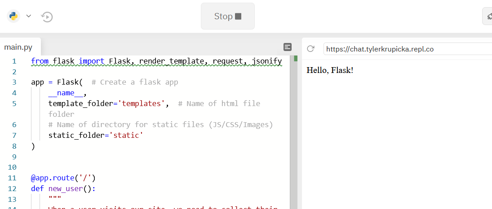
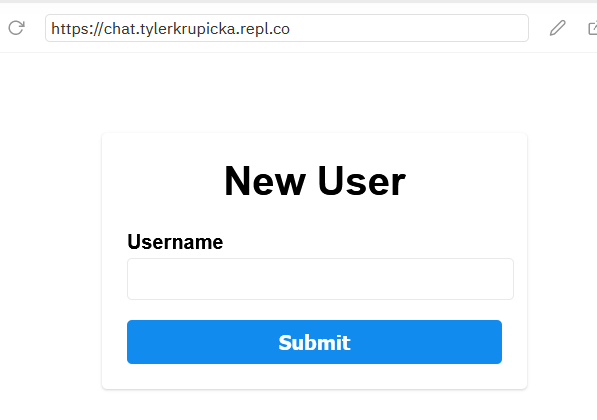
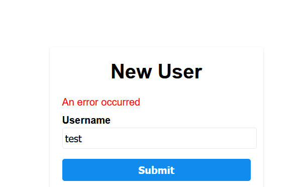
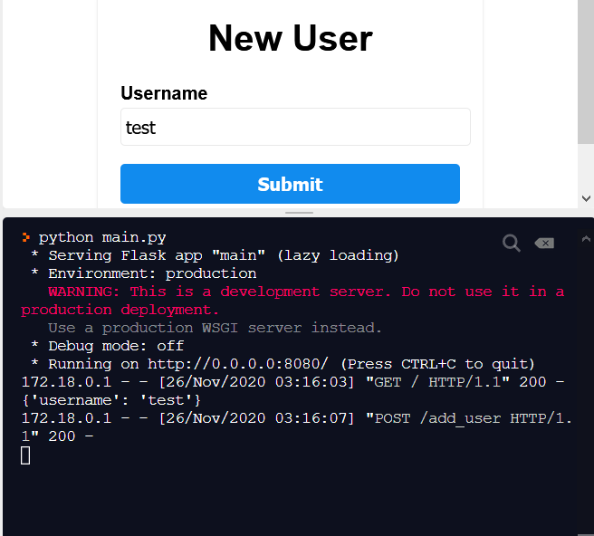

# Chat App Tutorial

> Building a simple chat website using Python!

This tutorial will go through the steps to build a simple but functional chat application. Most of the project will be done in Python, but there will be a little bit of HTML and JavaScript used to build the page the user sees.

## Background

In this project we will be building a website using the [Flask](https://flask.palletsprojects.com/en/1.1.x/) "micro" web-server project. If you have never built a website before, this may be a little confusing to start. In this section, I'll try to cover the basics of how our project is going to work. If you already have some understanding of websites, you can skip this section and just jump in to the project.

There are many different ways to build a website, but _in general_ there are a couple major pieces you need to make a full web application: a web page, and a web server.

### Web Pages

Web pages are what a user actually sees and interacts with in their browser (Chrome, FireFox, etc). Just like Microsoft Word can open a `.doc` file, web browsers can open and display `.html` files that determine how the page looks. In addition, pages can include `.js` (JavaScript) files to make the page interactive and `.css` (Cascading Style Sheets) files to add colors and layout to the page.

#### HTML

[HTML](https://developer.mozilla.org/en-US/docs/Web/HTML) is the content of the page, including all of the text and the basic layout. A basic HTML file looks like the following:

```html
<!DOCTYPE html>
<html lang="en">
    <head>
        <meta charset="UTF-8">
        <title>The title that shows up in the tab</title>
    </head>
    <body>
        <p>A basic paragraph of text!</p>
        <button>Click me!</button>
    </body>
</html>
```

#### JavaScript

[JavaScript](https://developer.mozilla.org/en-US/docs/Web/JavaScript)is code that you can run in your page to make it interactive. There's _a lot_ that you can do with JavaScript, but for this exercise we'll be focusing on the basics: event handlers and requests. In the following example, we'll make the button from the HTML example print a message when clicked.

```js
// The `document` variable gives you access to the current HTML page
// We are searching for a `button` on the page and setting it equal to a variable
const button = document.querySelector('button');

// Now we can run code when the button is clicked!
button.addEventListener('click', () => {
    // Console is how you print messages in JavaScript.
    // You can use console.warn or console.error to print colored messages as well
    console.log('Button was clicked!')
})
```

#### CSS

[CSS](https://developer.mozilla.org/en-US/docs/Web/CSS) allows you to change the appearance of your page. By default, buttons are gray with square corners. If you would like to make the buttons blue with rounded corners, CSS is how you would do it. In this project all of the CSS will be supplied, but you can always change it!

```css
button {
    background-color: blue;
    color: white;
    border-radius: 4px;
}
```

### Web Servers

A web server, in its most basic form, is a program that can send or receive [HTTP](https://developer.mozilla.org/en-US/docs/Web/HTTP) 'requests'. In this project we'll be using `Flask` to make our web server in Python. I'll cover some of the basic concepts below.

<p align="center">
  
</p>


#### Routing (URLs)

You are probably familiar with the "URLs" you use to reach popular websites. In a very basic web server, the different `/route/paths` are actually folders going to different HTML files. In our web server, we'll be using it to run different functions in our Python program. Here's a basic example:

```python
@app.route('/')
def home():
  return "I am the homepage!"

@app.route('/profile')
def home():
  return "I am profile page!"
```

A user navigating to `http://oursite.xyz/` would get the first message while `http://oursite.xyz/profile` would get the second one. If you want to learn more about URLs, I recommend the [MDN guide](https://developer.mozilla.org/en-US/docs/Learn/Common_questions/What_is_a_URL).

#### Returning HTML

So we know how to return some text, but in the last section we showed how HTML files are the real content of a web page. How do we display those using Flask? It's pretty simple:

```py
@app.route('/')
def home():
  # index.html is a html file in our 'templates' folder
  return render_template("index.html") 
```

Our HTML file is called a "template", because we can add variables to it. Here's an example:

```html
<!-- index.html -->
<!DOCTYPE html>
<html lang="en">
    <head>
        <title>{{ page_title}}</title>
    </head>
</html>
```

```py
@app.route('/')
def home():
  # We can change the page title by passing a variable in Python
  return render_template("index.html", page_title="Home Page") 
```

#### Receiving Data

Just like our Flask app can return pages and data to the browser, pages can send our Flask app data. We'll create a URL that the page can send data to, and then get the information we were sent using `get_json()`. [JSON](https://developer.mozilla.org/en-US/docs/Web/JavaScript/Reference/Global_Objects/JSON) is a data format very similar to a Python [dictionaries](https://docs.python.org/3/tutorial/datastructures.html#dictionaries), and the `get_json` function will convert it in to a Python dictionary for us.

```py
@app.route('/send_json')
def send_json():
  # data = { "message": "hello server""}
  data = request.get_json()
  print(data["message"]) # We will see "hello server" printed
```

#### Sending Data

Similarly, we can send data to the page in the JSON format by converting our Python variables to JSON.

```py
@app.route('/get_json')
def get_json():
  data = {"message" : "hello page" }
  return jsonify(data)
```

#### Status Codes

Every time our server sends or receives some data, it adds a [status code](https://developer.mozilla.org/en-US/docs/Web/HTTP/Status) to let the page know whether the action worked. You may be already familiar with status code `404`, which means you tried to go to a page that doesn't exist. There are a lot of different codes, but the most common are `200` (Success) and `400` (Bad Request). There's also some obscure ones like [418](https://developer.mozilla.org/en-US/docs/Web/HTTP/Status/418) "I'm a teapot".

By default when we `return` anything Flask will send along a `200` response code to say it succeeded. What if it fails? The page could send us data in the wrong format, and we need to indicate that we didn't complete it.

```py
@app.route('/send_json')
def send_json():
  # We are expecting data = { "message": "hello server""}
  data = request.get_json()
  if ("message" not in data):
    # They did not add a message to their data
    return "Bad data", 400
  return "Good data" # 200 is automatic
```

## Getting Started

### Creating your Repl

For this tutorial, we will be using [Repl It](https://repl.it) to run our site. If you haven't already:

[Clone this REPL](https://repl.it/github/tylerkrupicka/chat)

When that is completed, you should have a new REPL with a directory structure like this:

```
main.py
templates/
static/
docs/
README.md
```

For this project, we will mostly be working in the `main.py` file and `templates/` folder.

### Running the REPL

To make sure everything works, click the `Run` button on the top of the screen. You should see the Flask application start, and open a webpage.

<p align="center">
  
</p>

Congratulations! You have a working Flask website.

## New User Sign Up

We're building a chat application so the first thing we should do is make it possible to send messages, right? Well, not quite. We need to know who is sending each message, which means we need to make users create a `username` before joining the chat.

### Showing the New User Template

Navigate to the `main.py` file and look for the `new_user_page` function. It will look like this:

```py
@app.route('/')
def new_user_page():
```

Notice the `app.route` above the function. The `/` route is our homepage, which means a new user will see this page first when they go to our website.

To start, this function is just returning the text `Hello, Flask`. Can you update it to render the `new_user.html` template based on the Flask tutorial above?

After you make a change, you'll need to stop and start your program to get the latest updates. You may also need to hit the reload button on the website preview. When you have the template rendering it should look like this:

<p align="center">
  
</p>

### Sending a Username

Now we need to write some JavaScript to make the page work. When a user clicks the `Submit` button, we need to:

1. Get the text of the username they want to use.
2. Check that it is valid.
3. Send the username to our Flask app.
4. Check the response and either show an error, or sign them in.

Since this project is more about learning Python than JavaScript. A lot of this code will be provided.

Open the `templates/new_user.html` file and locate the `<script>` area near the bottom. This will be where we write our code.

```html
<script>
// Write your JavaScript here
</script>
```

#### Basic Structure

Add the following code to your script area:

```js
// Write your JavaScript here
const button = document.getElementById("submit-username");
const input = document.getElementById("username");

async function sendUsername() {
  // Get the username
  
  // Check if it is not empty

  // Send it to our Python program

  // Check the results
}

button.addEventListener("click", sendUsername);
```

Let's break down what that is doing. If you look in at the `<button>` higher up in the file, it has an `id` of `submit-username`. On the first line, we use that ID to get the button as a JavaScript variable. We do the same thing for the text input on the next line. Going forward, we can use these variables to find out what the user typed and when the click the button. 

On the next line, we create a function called `sendUsername` which will send the username.

On the final line, we add what is called an "event listener". For this example, we are saying "whenever `button` is `clicked`, run our `sendUsername` function.

#### The Send Function

##### Get the Input Value
Now let's fill out that send function. First, we need to get what the user has typed into the input. This can be done by getting the `value` of the `input`.

```js
// Get the username
const username = input.value;
```

> The `const` creates a new `constant` variable. This means the variable can not be changed. We could also declare it with `var` or `let` if we plan on changing it. You can [read more on MDN](https://developer.mozilla.org/en-US/docs/Web/JavaScript/Reference/Statements/const).


##### Validate the Username

Next, we need to check and make sure they have typed a username before sending. This can be done like this:

```js
// Check if it is not empty
if (username.length === 0){
  setError("Username is empty");
}
```

A few notes:

- In JavaScript you get the length of a variable using `.length`.
- The `===` equals sign is not a typo, in JavaScript you use three equals signs for [strict equality](https://developer.mozilla.org/en-US/docs/Web/JavaScript/Reference/Operators/Strict_equality). 
- The `setError` function is not a standard JavaScript function. I have created it for you since it might be confusing. Tricky, right?

##### Send the Username to Flask

Next, we need to send the username to our Flask application. We can send the data using the [fetch](https://developer.mozilla.org/en-US/docs/Web/API/Fetch_API) function in JavaScript.


```js
// Send it to our Python program
const response = await fetch('/add_user', {
  method: 'POST',
  headers: {
    'Accept': 'application/json',
    'Content-Type': 'application/json'
  },
  body: JSON.stringify({username: username})
});
```

Some notes:

- You can mostly ignore the [await](https://developer.mozilla.org/en-US/docs/Web/JavaScript/Reference/Statements/async_function) before fetch. In JavaScript, you can have code that runs at the same time. This `await` just indicates that we want to wait for fetch to finish before continuing.
- Method `POST` is an [HTTP method](https://developer.mozilla.org/en-US/docs/Web/HTTP/Methods). `POST` usually means we want to send data, while `GET` usually means we want to get data. Since we are sending the username, we want `POST`.
- The headers tell Flask that we are sending our username in `JSON` format. This was covered in the background section.
- The body is the data we are sending, and we send it as text. `JSON.stringify` is a function that lets us send JSON as text.

##### Get the Response

We now have a variable called `response`, which will contain the response from our Flask server. We can check this to see if there were any errors. Look back at the status codes section if you are unsure about how web servers send back an error.

With that response, we can see if the username was added and let the user know.

```js
  // Check the results
  if (response.status === 200) {
    // Username was added successfully
    // We can redirect to another page later
  } else if (response.status === 400) {
    setError("Username is taken")
  } else {
    setError("An error occurred")
  }
```

##### Try it out

If we try to submit a username now, we should see an error appear. (You may need to restart your project and reload the page to see the changes).

<p align="center">
  
</p>

Why is it an error?

Well, we haven't actually set up our Python program to have a `/new_user` route! We'll do that next.

#### Add User Flask Route

##### Set up the Route

Back in `main.py` we need to add a `/new_user` route that gets the data we are sending from the page. If you remember, we're sending the data as `JSON` using a `POST` request. Here's how you would get that data using Flask:

```py
@app.route('/add_user', methods=['POST'])
def add_user():
    """
    When a user clicks submit on the new user page,
    their username will be sent here as JSON.
    """
    data = request.get_json() # Get the data sent from the page
    print(data)
    return "Got it!"
```

If you restart your repl, and submit a new user, you should see the username now show up in the Python console!


<p align="center">
  
</p>

As you can see in the picture, we now have a Python dictionary with the username in it! We can get the username using:

```py
data['username']
```

##### Check if the username exists

Now we need to check if the username exists, and return a response to the page. How do we know what other usernames are taken? We need to keep track of all the usernames we have seen so far.

In Python, we can probably do this using a list:

```py
users = []

if username in users:
  return "Already exists", 400 # Send an error 400
else:
  users.append(username) # Add username to users
  return "OK"
```

> Note: You'll need to create the users array _outside_ of your `add_user` function. If you make it _inside_, a new users array will be created every time somebody hits submit!